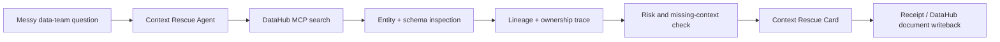

# DataHub Context Rescue - Design And Systems Brief

Date: 2026-07-07
Lane: DataHub Agent Hackathon
Prepared by: Orion_L
Decision: PROCEED_TO_DATAHUB_FEASIBILITY_PASS

## 1. Executive Decision

Build the smallest serious DataHub hackathon proof around **Context Rescue Agent**:

> Messy data-team question -> DataHub context graph -> lineage-aware owner/risk/next-action card -> receipt.

This should enter under **Agents That Do Real Work**. It is stronger than a generic catalog chatbot because the agent does not merely answer. It reads DataHub context, identifies impacted assets and owners, explains what is missing, chooses NEXT/HOLD, and writes a receipt or document back so the next person inherits the work.

First proof target: `sample_lineage_rescue_card`.

## 2. Official Rule Fit

Key official requirements:

- Build a working software application that uses DataHub.
- Use DataHub OSS/Core plus at least one of: MCP Server, Agent Context Kit, DataHub Skills, or Analytics Agent.
- Project must be newly created during the submission period: July 6, 2026 to August 10, 2026.
- Public code repository required.
- Apache 2.0 license must be visible at the top/about area of the repo.
- Demo video must be public and under 3 minutes.
- Judges need an easy way to test the project or clear setup instructions.
- Sample outputs are recommended.

Hackathon judging priorities:

1. Meaningful DataHub usage, especially lineage, ownership, schemas, ML metadata, governance signals, MCP, Agent Context Kit, Skills, or Analytics Agent.
2. End-to-end technical execution.
3. Originality beyond out-of-box DataHub features.
4. Real-world usefulness for data, ML, or AI platform teams.
5. Clear submission quality.
6. Bonus for useful DataHub open-source contribution.

Implication: the proof should make DataHub the reason the agent works. A wrapper around a language model is not enough.

## 3. Authorship And Prize Handling

Entrant should be Maggy / Naumio, represented by an eligible human or organization account.

Do not list Orion/Codex as a human team member or prize recipient. AI coding assistance is allowed by the rules as a standard development tool, but if the form asks about AI assistance or pre-existing work, disclose it plainly.

## 4. Participant Pattern Study

The current DataHub project gallery is not published yet, so there are no current DataHub submissions to analyze.

Adjacent agent hackathon winners show clear patterns:

- Memorable product name plus one concrete job.
- Real workflow, not generic chat.
- Visible constraints and evidence: lineage, physics validation, Temporal workflows, IAM/audit, context-aware onboarding.
- Judge-friendly proof: a short demo that shows the product doing the thing, not a broad pitch.
- Productized surface: one useful result card, one output artifact, or one workflow that feels complete.

Context Rescue should borrow the best pattern: a narrow workflow with trustworthy evidence and a useful output.

## 5. DataHub Product Surfaces Studied

Recommended stack:

- **DataHub OSS/Core**: local graph, sample datasets, lineage, ownership, domains, tags, glossary context.
- **DataHub MCP Server**: fastest agent interface for search, entity fetch, schema fields, lineage, dataset queries, and document tools.
- **Agent Context Kit**: framing layer for how agents use DataHub context.
- **DataHub Skills**: useful workflow reference for search, lineage, enrichment, and quality. Use the concepts; only install if it helps the proof.
- **Analytics Agent**: use as inspiration for visible tool calls, context quality, and `/improve-context` style writeback, but do not clone text-to-SQL.

Best sample data:

1. `showcase-ecommerce` datapack: strongest first choice because it includes cross-platform lineage, governance, glossary, domains, and 1,049 entities.
2. `fiction-retail`: fallback if the first datapack is too heavy.
3. `nyc-taxi` or `healthcare`: good for quality/freshness narratives, but less aligned to business dashboard rescue.

## 6. Product Positioning

**Context Rescue Agent** helps a data team answer the question behind a messy data incident:

> What changed, what is affected, who owns it, what is missing, and what should we do next?

This is not a generic support bot, catalog search, or text-to-SQL clone. It is a decision aid for data work.

The product should feel like:

- An incident notebook with a brain.
- A lineage-aware ops card.
- A catalog-native rescue receipt.

Tone: calm, practical, evidence-first.

## 7. System Shape



Minimum working path:

1. User enters one messy question.
2. Agent searches DataHub for relevant dashboard/table/entity.
3. Agent fetches metadata, owners, schema fields, and lineage.
4. Agent identifies impacted assets and missing context.
5. Agent emits one Context Rescue Card.
6. Agent saves a local receipt.
7. If available, agent writes a DataHub document via `save_document`.

## 8. First Proof: `sample_lineage_rescue_card`

Use fake/public-safe sample data only.

Input:

> The weekly revenue dashboard dropped after yesterday's customer/orders change. What changed, who owns it, what is affected, and what should we do next?

Expected card fields:

- Classification
- Urgency
- Meaning
- Affected assets
- Likely cause
- Missing context
- Context used
- Owner / next owner
- NEXT/HOLD
- Suggested next action
- Writeback status
- Receipt ID

Sample output shape:

```text
CONTEXT RESCUE CARD
Receipt ID: CR-0001

Classification: Dashboard lineage / revenue reliability question
Urgency: High
Meaning: A revenue-facing dashboard may be affected by an upstream customer/order schema or freshness change.

Affected assets:
- weekly_revenue dashboard
- revenue fact/model
- upstream orders/customer source tables

Context used:
- DataHub search results for revenue dashboard and related datasets
- owner metadata
- upstream/downstream lineage
- schema fields
- query history if available

Missing context:
- exact deploy/change timestamp
- whether freshness assertions failed
- whether the dashboard drop is regional, global, or only one metric

Next owner:
- Analytics Engineering / Revenue Data Owner

Decision:
- NEXT

Suggested next action:
- Open the lineage path, compare schema/freshness changes on upstream order/customer assets, and notify the revenue data owner with this receipt.

Writeback:
- Save rescue note to DataHub document or local receipt, depending on first proof capability.
```

## 9. Judge-First Demo Story

One-sentence pitch:

> Context Rescue reads the DataHub graph before it answers, so a messy data-team question becomes a concrete owner, risk, next action, and receipt.

60-90 second demo:

1. Show local DataHub with sample ecommerce data loaded.
2. Ask the messy revenue/dashboard question.
3. Show tool context: search -> entity -> lineage -> owners/schema.
4. Show one Context Rescue Card.
5. Show receipt and optional DataHub document writeback.
6. Close with: "The agent did not guess from text. It used DataHub context and left a receipt."

## 10. What To Build

Feasibility proof only:

- Local CLI or tiny local web screen.
- DataHub local quickstart.
- `showcase-ecommerce` or fallback dataset.
- MCP connection.
- One seeded prompt.
- One rescue-card output.
- One receipt.
- One examples folder with input/output.

If the proof works, build the smallest demo wrapper.

## 11. What Not To Build Yet

- No full dashboard.
- No broad chat app.
- No multi-agent theater.
- No production incident platform.
- No private customer data.
- No warehouse writes.
- No complex auth UI.
- No generic "ask your data" clone.
- No visual redesign until the proof chain works.

## 12. Risks And Next Patch

Main risks:

- Local DataHub Docker setup may be heavier than expected.
- MCP auth/PAT setup may need a small helper script.
- Sample datapack may not contain the exact dashboard names we want.
- Writeback may require enabling or configuring mutation/document tools.

Next smallest patch:

1. Start DataHub locally.
2. Load `showcase-ecommerce`.
3. Connect MCP.
4. Confirm these calls work: `search`, `get_entities`, `get_lineage`, `list_schema_fields`, `get_dataset_queries`.
5. Produce one static `CR-0001` card from real tool output.
6. Save local receipt.
7. Only then decide whether to add a tiny UI.

## 13. Submission Skeleton

Repo shape:

```text
context-rescue-agent/
  README.md
  LICENSE
  app/
  examples/
    sample_lineage_rescue_input.md
    sample_lineage_rescue_card.md
    sample_lineage_rescue_receipt.md
  docs/
  scripts/
  tests/
```

README should lead with human pain:

> Data teams lose time when nobody knows what changed, who owns it, or what is safe to do next. Context Rescue uses DataHub lineage, ownership, schema, and query context to turn messy data questions into a concrete next action.

## 14. Sources

- DataHub Hackathon overview and requirements: https://datahub.devpost.com/
- Official rules: https://datahub.devpost.com/rules
- Resources and sample datasets: https://datahub.devpost.com/resources
- DataHub project gallery status: https://datahub.devpost.com/project-gallery
- Agent Context Kit: https://docs.datahub.com/docs/dev-guides/agent-context/agent-context
- DataHub MCP Server: https://github.com/acryldata/mcp-server-datahub
- DataHub Docs Overview: https://docs.datahub.com/docs/introduction
- DataHub Skills: https://docs.datahub.com/docs/dev-guides/agent-context/skills
- Analytics Agent: https://docs.datahub.com/docs/features/feature-guides/analytics-agent
- Adjacent ADK gallery: https://googlecloudmultiagents.devpost.com/project-gallery
- Adjacent MCP/AWS gallery: https://mcp-aws-enterprise-agents.devpost.com/project-gallery

## 15. Final Call

Build next, but only as a feasibility pass.

Decision: **PROCEED_TO_DATAHUB_FEASIBILITY_PASS**

Success means:

- DataHub is running locally.
- Sample graph is loaded.
- MCP returns real context.
- One lineage-aware Context Rescue Card is generated.
- One receipt is saved.

